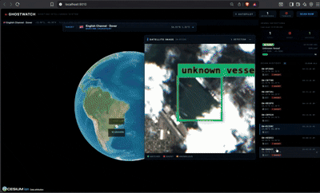

# GhostWatch

**AI-powered dark vessel detection from satellite imagery with autonomous drone-dispatch recommendations.**

<p align="center">
  
</p>

---

## Problem

A large class of suspicious maritime activity happens when vessels disable AIS, misreport their identity, or operate in ways that make conventional tracking unreliable. This creates major blind spots for illegal-fishing detection, sanctions-evasion monitoring, and maritime security operations.

Today, satellite imagery is sent to the ground for manual review — increasing bandwidth and delaying action. GhostWatch runs AI close to the data source and sends down only actionable intelligence.

## Solution

GhostWatch is an orbital maritime-intelligence system that:

1. **Ingests** satellite imagery from the DPhi SimSat pipeline (Sentinel-2 + Mapbox)
2. **Detects** vessels using a fine-tuned Liquid AI **LFM2.5-VL-450M** vision-language model
3. **Cross-checks** detections against AIS tracking data
4. **Flags** ghost vessels — ships visually present but missing from AIS
5. **Generates** drone dispatch coordinates for follow-up investigation

> **image in → ship found → anomaly detected → coordinates generated → drone dispatched**

---

## Architecture

```
 ┌──────────────┐                ┌────────────────────────┐
 │  SimSat Sim  │───telemetry───▶│      GhostWatch        │
 │  (port 9005) │◀──poll cmds────│      (port 9010)       │
 │              │                │                        │
 │ Orbit prop.  │                │ VLM detect / ghost log │
 │ Sentinel-2   │                │ AIS compare / dispatch │
 │ Mapbox       │                │ React + Cesium UI      │
 └──────────────┘                └────────────────────────┘
```

| Service | Port | Role |
|---------|------|------|
| **SimSat Simulator** | 9005 | Satellite orbit + Sentinel-2 / Mapbox imagery APIs |
| **GhostWatch** | 9010 | VLM detection + ghost analysis + dispatch + dashboard UI |

---

## Quick start

### Prerequisites

- **Python 3.10+** (3.11 recommended) and **Node 20+**
- Optional: **Mapbox token** for higher-res tiles (Sentinel-2 still works without it)
- Optional: **HuggingFace token** — only needed if you hit anonymous-download rate limits

### One-command setup + run

```bash
./run.sh
```

That's it. The script auto-detects a Python 3.10+ interpreter (tries
`python3.13` → `python3.12` → `python3.11` → `python3.10` → `python3`),
creates 2 isolated venvs, installs everything, builds the React frontend,
starts both services in the background, and opens the dashboard at
**http://localhost:9010**.

| Command | What it does |
|---|---|
| `./run.sh` | First-time setup + start everything |
| `./run.sh stop` | Kill both services |
| `./run.sh logs` | Tail combined logs |
| `./run.sh status` | Show which services are alive |

The model (~900 MB) downloads from HuggingFace on the first **SCAN NOW** click
and is cached in `~/.cache/huggingface/` after that. CPU inference takes ~30-90s
per scan on a Mac without a GPU.

### Run with Docker

```bash
export GHOSTWATCH_MODEL=AryanNsc/LMF2.5-VL-Ghost-V1
docker compose up --build
```

### Run without a GPU (mock mode)

For instant synthetic detections — useful for UI development without waiting on CPU inference:

```bash
GHOSTWATCH_MOCK_MODE=true python -m ghostwatch.main
```

---

## Manual setup (if `./run.sh` doesn't work)

Use this if `./run.sh` fails for any reason — wrong Python version detected,
permission issues, port conflicts, or you just want to see each service's
stdout live in its own terminal.

### Step 1 — Install prerequisites

**macOS** (Homebrew):
```bash
brew install python@3.11 node
```

**Ubuntu / Debian**:
```bash
sudo apt update
sudo apt install python3.11 python3.11-venv python3-pip
# Node 20 (use NodeSource if your distro ships an older version):
curl -fsSL https://deb.nodesource.com/setup_20.x | sudo -E bash -
sudo apt install nodejs
```

Verify:
```bash
python3.11 --version    # 3.10 or newer
node --version          # v20 or newer
npm --version
```

### Step 2 — Clone and enter the repo

```bash
git clone <this-repo-url> ghost_watch
cd ghost_watch
```

### Step 3 — Set up the SimSat sim (Terminal 1)

```bash
cd SimSat/src/sim
python3.11 -m venv .venv
source .venv/bin/activate
pip install --upgrade pip wheel
pip install -r requirements.txt
```

Run it:
```bash
SIM_PORT=9005 \
DASHBOARD_URL=http://localhost:9010 \
python main.py --timing 25 --time-step 20
```

You should see `[SIM] ...` log lines and the FastAPI server bind on `:9005`.
Leave this running.

### Step 4 — Set up GhostWatch backend + frontend (Terminal 2)

In a fresh terminal, from the project root:

```bash
# 4a. Python venv for the backend
python3.11 -m venv venv
source venv/bin/activate
pip install --upgrade pip wheel
pip install -r ghostwatch/requirements.txt
```

```bash
# 4b. Build the React frontend (one-time, ~30s)
cd ghostwatch/frontend
npm install
npm run build
cd ../..
```

Run the backend (which serves both the detection API and the dashboard):
```bash
GHOSTWATCH_MODEL=AryanNsc/LMF2.5-VL-Ghost-V1 \
SIMSAT_API_URL=http://localhost:9005 \
python -m ghostwatch.main
```

You should see:
```
[GhostWatch] Starting up...
[GhostWatch] Loading model: AryanNsc/LMF2.5-VL-Ghost-V1
[GhostWatch] Ready.
INFO: Uvicorn running on http://0.0.0.0:9010
```

### Step 5 — Open the dashboard

Visit **http://localhost:9010** in your browser. You should see:
- A 3D Earth globe (Cesium) with a satellite icon orbiting
- A "TARGET" HUD selector at the top with maritime hotspots
- Empty TELEMETRY / VESSEL DETECTIONS panels on the right

Pick a region from the dropdown, click **SCAN NOW**, and wait ~30-90 seconds
(CPU inference on first run; subsequent scans are faster). Detections
appear on the globe and in the side panel.


## The fine-tuned model

The base **LFM2.5-VL-450M** is great at general vision-language tasks but doesn't reliably ground vessels in 10-meter-resolution Sentinel-2 imagery. We fine-tuned it via LoRA on a combined corpus of three datasets:

| Dataset | Samples | Purpose |
|---|---|---|
| HRSC2016 | ~1,000 | Multi-class ship taxonomy |
| ShipRSImageNet | ~3,400 | Fine-grained class labels (50+ ship types) |
| MASATI v2 | ~2,500 | Maritime aerial / Sentinel-resolution scenes |

After 5× augmentation we trained for 2 epochs on a single T4. Final loss: **0.62** (started at 1.3). Adapter was merged into the base and pushed to HuggingFace as a single-line load:

```python
from transformers import AutoModelForImageTextToText, AutoProcessor
model = AutoModelForImageTextToText.from_pretrained(
    "AryanNsc/LMF2.5-VL-Ghost-V1",
    torch_dtype="bfloat16", device_map="auto", trust_remote_code=True,
)
processor = AutoProcessor.from_pretrained(
    "AryanNsc/LMF2.5-VL-Ghost-V1", trust_remote_code=True,
)
```

The detector ([ghostwatch/detector/vlm_detector.py](ghostwatch/detector/vlm_detector.py)) auto-detects when the fine-tuned model is loaded and uses the exact prompt the model was trained on, skipping the multi-prompt fallback chain the base model needed.

---

## API endpoints

| Method | Endpoint | Description |
|--------|----------|-------------|
| `POST` | `/api/scan` | Scan a region — fetch imagery, detect vessels, analyze ghosts |
| `POST` | `/api/scan/current` | Scan at the satellite's current orbital position |
| `GET`  | `/api/detections` | Recent detection history |
| `GET`  | `/api/detections/{id}` | Single detection detail |
| `POST` | `/api/dispatch/{id}` | Generate drone dispatch mission for a ghost vessel |
| `GET`  | `/api/health` | Service health + model status |

### Example scan response

```json
{
  "scan_id": "GW-A1B2C3",
  "image_available": true,
  "image_base64": "iVBORw0KGgo...",
  "detections": [
    {
      "detection_id": "GW-A1B2C3-001",
      "label": "boat",
      "confidence": 0.91,
      "bbox": [0.26, 0.34, 0.45, 0.61],
      "coordinates": { "lat": 1.25, "lon": 103.82 },
      "ghost_status": "ghost",
      "risk_score": 87,
      "reason": "Visual vessel detected but no matching AIS signal"
    }
  ],
  "summary": {
    "total_vessels": 5,
    "ghost_vessels": 2,
    "matched_vessels": 3,
    "dispatches_recommended": 2
  }
}
```
---

The published HuggingFace model ([AryanNsc/LMF2.5-VL-Ghost-V1](https://huggingface.co/AryanNsc/LMF2.5-VL-Ghost-V1))
lets the dashboard run end-to-end without any local training. The `training/`
folder shows exactly how it was made — datasets, augmentation, LoRA config,
merge + push.

---